## Как пользоваться «Важные шаги»

Эта инструкция объясняет, как всё работает, и помогает разобраться в деталях и неочевидных моментах.  
Приложение автоматически считает музыкальную восьмёрку (**1–2–3–4–5–6–7–8**) и показывает, названия шагов для выполнения. Вы можете тренироваться под встроенный клик (метроном) или под музыку из каталога. Также доступна запись на камеру: в готовый видеоролик попадет только картинка и чистый звук из приложения, без посторонних шумов с микрофона.

Интерфейс одинаково выглядит и работает на всех платформах: в Мессенджере, в приложении на Android и в обычном браузере.
(Все скриншоты в данной инструкции сделаны в светлой цветовой теме).

---

## Главный экран

Центр экрана занимает лента с карточками шагов. Текущий шаг выделен самым ярким цветом — его вы танцуете прямо сейчас.
Следующие шаги расположены ниже и чтобы вы могли заранее увидеть смену движения, но не отвлекались от текущего, они менее яркие.
Карточка сменяется, когда наступает следующий счёт 1 или 5.
Если полное название не влезает на плашку, в конце точка. Так на ленте, в «Ностальгии» и на плашках над видео.

Внизу экрана - панель со значками / кнопками.

<table width="100%" style="width:100%;table-layout:fixed">
<tr>
<th width="25%" style="width:25%">Кнопка</th>
<th width="75%" style="width:75%">Что делает</th>
</tr>
<tr>
<td > </td>
<td >Включает съёмку. Первый раз картинка открывается на весь экран. Если камера недоступна, значка нет. Подробности — в разделе про камеру.</td>
</tr>
<tr>
<td > </td>
<td >Шестерёнка открывает меню с настройками и дополнительным функционалом.</td>
</tr>
<tr>
<td > </td>
<td >Вид кнопки по центру, пока ничего не играет. Запускает клик или трек.</td>
</tr>
<tr>
<td > </td>
<td >(Кнопка во время игры): приостанавливает счёт и музыку. Лента замирает. При повторном нажатии счёт продолжится ровно с того места, где вы остановились.</td>
</tr>
<tr>
<td > 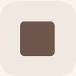</td>
<td >Полностью прекращает воспроизведение и сбрасывает последовательность на самый первый шаг. Если у вас включено перемешивание, то эта кнопка перемешает шаги для нового захода.</td>
</tr>
<tr>
<td > 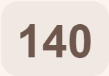</td>
<td >Число bpm справа. При первом запуске 140. Открывает окно скорости bpm клика или если играет трек, то музыки.</td>
</tr>
</table>

Во время счёта в правом верхнем углу экрана отображается время текущего захода. При нажатии на Паузу время замирает, при нажатии на Стоп — обнуляется.

---

## Клик и скорость

Нажмите число темпа справа внизу. Откроется окно «Скорость bpm». Закрыть панель можно тапом по затемненному фону вокруг.

Регулировка темпа: Маленькие кнопки (+) и (-) изменяют скорость на 1 единицу, большие — на 5 единиц. Ниже находятся кнопки для мгновенной установки стандартных скоростей: 100, 140, 160, 180. При первом запуске стоит 140. Приложение запоминает темп, который вы выставили.

**Запустить клик** — то же, что кнопка Старт на главном экране: начинает или ставит на паузу. Пока клик идёт, надпись меняется на «Остановить метроном»: счёт встаёт на паузу. Первое нажатие, которое запускает клик, ещё и сворачивает это окно.

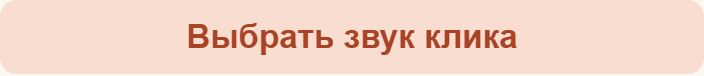

**Выбрать звук клика** Открывает меню доступных тембров. Названия у них короткие, поэтому подбирать подходящий звук рекомендуется на слух. По умолчанию активен звук «Квадрат».

**Выбрать музыку** переведет вас в каталог песен (подробнее см. в следующем разделе)

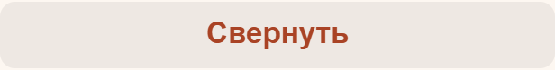

**Свернуть** Закрывает панель, оставляя активным текущий звук или музыку.

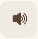

**Динамик** Расположена рядом со «Свернуть». Она выключает исключительно звук метронома и никак не влияет на общую громкость телефона или звучание музыкальных треков. Оставлена как ностальгия по тому, с чего началось это приложение.

---

## Музыка вместо клика

**Выбрать музыку** открывает встроенный музыкальный каталог. Все треки в нём уже проанализированы: темп и ритмическая сетка зафиксированы, поэтому вручную изменить BPM у песни нельзя (число скорости просто отображается на экране).

Навигация и фильтры в каталоге (Верхняя строка):
* Левый треугольник: Сортирует песни по темпу (быстрее / медленнее).
* Правый треугольник: Сортирует треки по названию в алфавитном порядке.
* Текст по центру: Показывает, какой режим сортировки активен прямо сейчас.
* Звезда (справа вверху): Включает фильтр «Избранное», скрывая остальные песни. Если вы ещё не добавили треки в любимые, экран покажет надпись «Нет избранных треков». Чтобы вернуть полный список, просто нажмите на эту звезду еще раз.

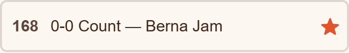

Каждая строка содержит информацию о темпе, названии песни. Звезда напротив песни — добавляет конкретный трек в Избранное или удаляет его оттуда. Песня, которая уже загружена в память телефона, обведена цветом акцента. Играть можно и до конца загрузки: пока файл скачивается (отображается полоса прогресса), звук уже начнет играть.

После выбора трека окно скорости метронома превращается в плеер этой песни.
Примечание: Кнопка Стоп в режиме музыки также сбрасывает последовательность в начало. Кнопка Динамик отключает только звук клика, громкость воспроизведения песни она не регулирует.

Запускает трек или ставит его на паузу. Лента идёт по сетке песни, не по клику. Пауза не сдвигает плашку. Надпись на кнопке меняется.

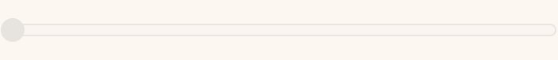

Перемотка. Плашка встаёт на то место в цепочке, где сейчас музыка. Если песня попала на счёт 5, остаётесь на плашке этой пятёрки, а не прыгаете в начало.

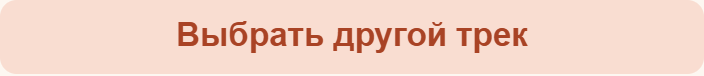

Снова каталог. Текущую песню можно заменить.

Отправляет файл в чат с ботом. Кнопка есть только в Мессенджере и только у трека из каталога.

Песня уходит, снова клик и ваша скорость.

---

## Цепочка шагов

Перейдите в меню: Настройки → Изменить цепочку шагов.

Здесь отображаются шаги, которые используются в текущей тренировке: после иконки короткая подпись в скобках, под названием номер («1», «2»...). Остальные доступные движения помечены «не выбран». В цепочке шагов должны быть активированы минимум два шага.

**Назад** — справа сверху. Возвращает на предыдущий экран. Такая кнопка есть на каждом экране настроек. Кнопка «Назад» на корпусе телефона на этих экранах делает то же самое и не сворачивает приложение.

**Плюс** Создает дубликат шага. Это позволяет использовать одно и то же движение несколько раз внутри одной цепочки (в том числе подряд).

  

**Стрелки** Меняют шаги местами с соседним. У самого первого элемента кнопка «вверх» заблокирована, у последнего — «вниз».

**Галка** Исключает шаг из активных. У невыбранных шагов на этом месте отображается пустой квадрат — нажатие на него добавляет движение в самый конец рабочей цепочки.

Жесты: Длинное нажатие на выбранную карточку шага позволяет поднять её и перетащить в любую точку списка. Короткий свайп используется для обычной прокрутки.

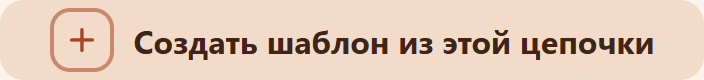

**Создать шаблон из этой цепочки** Сохраняет собранную вами последовательность под уникальным именем. Вы сможете мгновенно активировать её позже через раздел «Шаблоны цепочек шагов».

**Перемешать цепочку шагов** Мгновенно перемешивает выбранные шаги прямо в этом списке (невыбранные остаются на месте). Если включена опция «Не ставить одинаковые рядом», одинаковые движения не окажутся друг за другом. Настройки отображения («на 4» или «на 8») на эту кнопку не влияют — шаги перемешиваются строго поодиночке.

**Добавить Базовый между другими** Автоматически вставляет шаг «Базовый» между всеми остальными движениями, если его там еще нет. Кнопка становится неактивной, если свободных мест для вставки не осталось.

**Добавить свой** — Создает персональный шаг. Полное название может содержать до 14 символов, короткое (аббревиатура) на плашке — до 4. Если не выбрать для него иконку, на плашке останется пустая рамка.

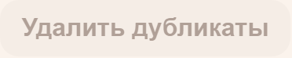

**Удалить дубликаты** Очищает цепочку от повторяющихся шагов. Если повторов нет или после удаления в списке останется меньше 2 шагов, кнопка будет неактивна и цепочка не изменится.

---

## Камера

Верхняя полоса экрана при включённой камере остаётся на месте.

Первый раз картинка открывается во весь экран и закрывает ленту. Тап по самой картинке уменьшает её до окна внизу слева. Ещё один тап возвращает полный экран. «Скрыто» так не выбирается, только кнопкой в окне ниже. Крестик на картинке выключает камеру.

Те же переключатели есть в окне скорости и в окне музыки. Пока камера включена, там видно «Выключить режим камеры» и ряд «Изображение с камеры».

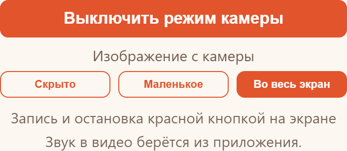

**Скрыто** убирает картинку, красная кнопка записи остаётся на экране. **Маленькое** — окно внизу слева, ширина повторяет пропорции картинки с камеры. Пока окно маленькое, плашки ниже следующей прижаты вправо, уходящая — влево, чтобы меньше закрывать картинку. В «Ностальгии» квадраты остаются на своих местах. **Во весь экран** — как при первом открытии. Пока идёт запись, картинка занимает и место нижнего дока: кнопки дока на это время спрятаны, пропорции кадра не тянутся. Остановили запись или переключили картинку в маленькое окно — док снова на месте, запись при этом не обрывается. Подпись под рядом напоминает: запись и остановка — красной кнопкой, звук в видео берётся из приложения.

Красная кнопка начинает и останавливает дубль. Играть, Пауза и Стоп её не заменяют. Пауза замирает клик или песню, а запись идёт дальше: пока песня стоит, в файле на этом месте тишина. Стоп возвращает танец в начало, красная кнопка при этом не гаснет. Дубль сам заканчивается, если выключить камеру, нажать крестик на картинке или если песня доиграла до конца.

В файл пишется картинка с фронтальной камеры и **звук приложения**: клик или трек, который вы слышите. Микрофон комнаты не пишется. Поэтому в тихом зале в ролике всё равно есть музыка, а разговоры рядом — нет.

Неочевидное про звук в ролике. Иногда звук для файла снимается, пока трек ещё стоит на паузе, и на части телефонов в ролике так и остаётся тишина, хотя из динамика песня при этом играет. Поэтому перед стартом дубля приложение снимает звук заново, если трек уже играет. Надёжный порядок: сначала Играть, потом красная кнопка. Если всё же две секунды запись идёт, часы тикают, а звука в дорожке нет, появится надпись «В записи нет звука — остановите дубль и начните заново». Дорожку у уже идущей записи поменять нельзя: ни паузой, ни сменой песни посреди дубля. Новый звук — в новом дубле. Поэтому лучше остановить и снять ещё раз, пока вы на месте.

Если запись вышла пустой (камера замолчала после сворачивания или второго дубля), приложение пишет об этом и само переоткрывает камеру. Перезапускать всё приложение не нужно.

После стопа откроется «Видео готово».

Кладёт файл на устройство. Имя вида Dance-Steps-дата-время.

Есть в Мессенджере. Кладёт ролик в чат с ботом.

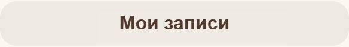

Ролики и скачанная музыка, которые ещё лежат на этом устройстве. Экран дальше.

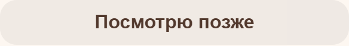

Не сохраняет файл сейчас. Дубль остаётся в «Моих записях», пока его не заберёте или не удалите.

Этот дубль с устройства удаляется.

### Мои записи

Та же кнопка есть в окне скорости и музыки, когда на устройстве уже лежит дубль или скачанная песня. Если дубль сняли и не сохранили, на кнопке будет подпись «· N не сохранено».

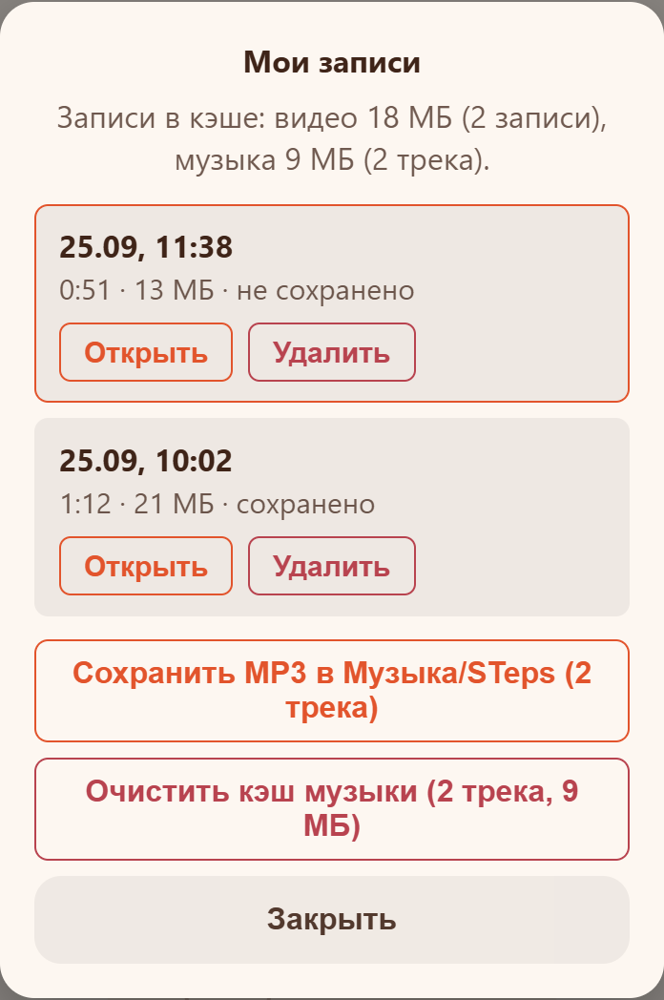

На кадре пример, не ваш список. Сверху — сколько места заняли ролики и скачанные песни. Ролик с подписью «не сохранено» обведён: файла в загрузках ещё нет, копия только здесь. «Открыть» возвращает окно «Видео готово», оттуда его можно сохранить. «Удалить» с первого раза не стирает: надпись меняется на «Точно удалить?», и только второе нажатие убирает ролик. Если он ещё не был сохранён, другого файла нет. Уже сохранённый «Удалить» убирает только из этого списка, копия в загрузках остаётся.

Музыка здесь не списком песен. «Сохранить MP3 в Музыка/STeps» есть в приложении на Android: копии скачанных треков кладутся в эту папку. «Очистить кэш музыки» есть везде, где песни уже скачались. Первое нажатие меняет надпись на «Точно очистить?». Каталог на экране остаётся, с устройства уходит только копия, в следующий раз файл скачается снова.

Если в подсказке мелькает большое число «лимит браузера», это потолок вкладки, не свободное место на телефоне.

---

## Разбор режимов перемешивания шагов

В приложении есть два разных инструмента перемешивания, которые легко спутать.

### Переключатель «Перемешивать шаги»

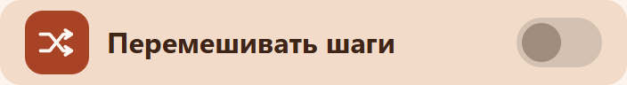

Выключен: шаги идут в том порядке, в котором собрана цепочка. Строки «Не ставить одинаковые рядом» нет.

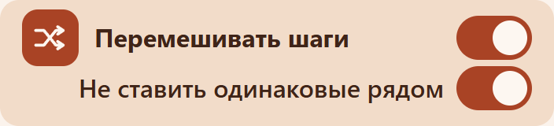

Включён: случайный порядок создаётся один раз при старте с начала (первый Играть или старт после Стоп) и крутится по кругу. Под переключателем появляется вторая строка.

Пауза порядок не меняет. Новый круг — Стоп, затем снова Играть.

* На «на 4» тасуются одиночные шаги. На «на 8» второй строки «Показывать шаг» тасуются целые восьмёрки, и два соседних шага с одним названием остаются парой. «Плашка шага активна» на 8 счетов эту пару не включает: шаг один на всю восьмёрку.
* Если при включённом перемешивании нажать «Перемешать цепочку шагов», текущий круг доигрывается. Новый список включается после Стоп.

### «Не ставить одинаковые рядом»

Вторая строка карточки «Перемешивать шаги». Пока перемешивание выключено, строки нет. Сам переключатель по умолчанию выключен.

Включён: алгоритмы перемешивания не ставят карточки с одинаковым названием друг за другом. Если цепочка почти из одного движения, развести шаги некуда, и они останутся соседями.

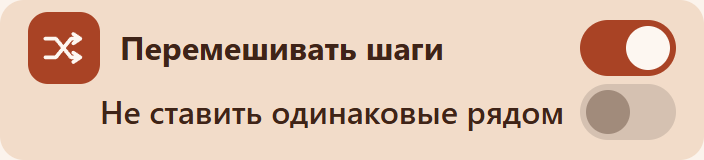

Выключен: одинаковые шаги могут выпасть подряд.

---

## На 4 счёта или на 8

Настройки → **Плашка шага активна**. Слева «4», справа «8 счетов». Пока выбрано «4», под карточкой вторая строка: **Показывать шаг**, «на 4» и «на 8 счетов». На «8 счетов» эта строка прячется.

**8 счетов.** Один шаг — одна плашка. Она стоит всю восьмёрку и сменяется со следующим счётом 1. Двух карточек одного шага нет. Так же ведут себя плашки над видео: название держится до 6-го счёта и уходит на 7-м и 8-м.

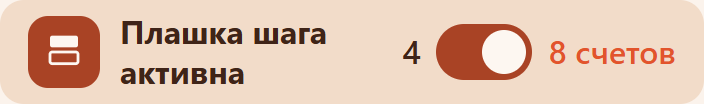

**на 4.** Одна карточка шага удерживается половину восьмёрки (счёты 1–4), на счёте 5 включается следующая карточка из цепочки.

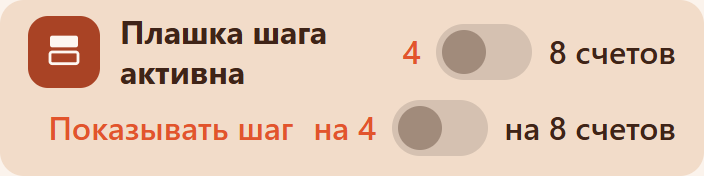

**на 8.** На экране две плашки одного шага: первая на счётах 1–4, вторая на 5–8. Сетка трека или клика не меняется.

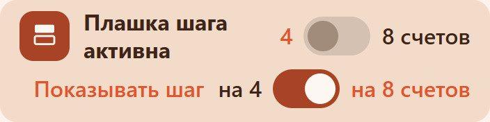

Если вы запустили песню и попали на её середину (счёт 5–8) в режиме двух плашек, текущую восьмёрку доиграет финальный шаг цепочки, а с новой сильной доли 1 показ начнётся с начала собранного списка.

---

## Как едет лента

Настройки → **Движение плашек**. Меняется только анимация. В режимах с лентой крупная текущая плашка и следующий шаг под ней остаются. «Ностальгия» ленту не крутит: шаги стоят сеткой.

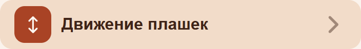

Пункт открывает пять режимов. Галочка стоит на том, который сейчас выбран. Сначала выбран «Плавно». Если раньше стояло «Перед сменой» и вы его после этого обновления сами не выбирали заново, оно тоже станет «Плавно».

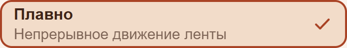

**Плавно.** Лента ползёт всё время, пока идёт шаг.

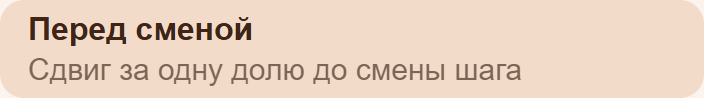

**Перед сменой.** Лента сдвигается за одну долю до смены. На «на 4» и на двух плашках «на 8» новая плашка уже на месте, когда приходит 1 или 5. Когда плашка активна на 8 счетов, сдвиг идёт за одну долю до следующего счёта 1.

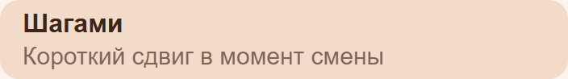

**Шагами.** Короткий сдвиг ровно в момент смены.

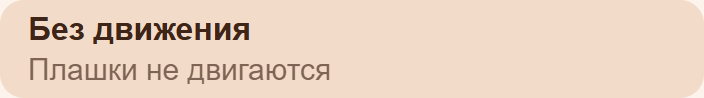

**Без движения.** Плашки не едут. Если в телефоне включено «меньше анимации», приложение само встаёт на этот режим.

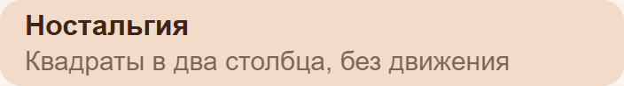

**Ностальгия.** Шаги стоят в два столбца на всю ширину и не едут. Правый столбец смещён вниз примерно на треть высоты квадрата. Пока всё влезает на экран, это квадраты. Если нет, свободный воздух внутри сжимается, и только потом появляется прокрутка. Выделены два: текущий и следующий, который постепенно заливается и потом становится текущим. На плашке аббревиатура и название шага.

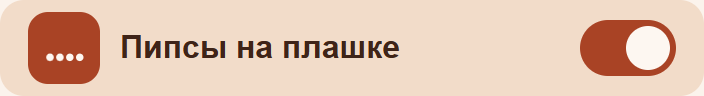

**Пипсы на плашке** — четыре точки на шаге, по одной на счёт. По умолчанию выключены. На следующей плашке ряд появляется примерно за пятую долю секунды до того, как она станет текущей, и первая точка успевает вырасти. Выросшая чуть отодвигает соседние. Выключили — точек нет, смена шага та же. В «Ностальгии» точек нет.

**Цифры счёта на экране** — в разделе «Вид». Выключено по умолчанию. Пока выключено, цифры счёта нигде не рисуются: ни одна плашка слева, ни ряд сверху. Второй строки у карточки нет.

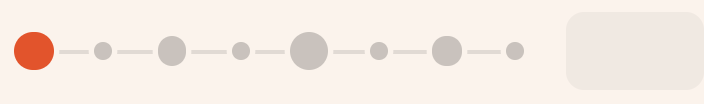

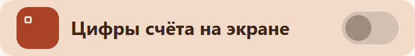

Включили — карточка подрастает, и снизу появляется «Ряд цифр счёта вверху». Этот переключатель тоже выключен. На полосе слева одна плашка с текущим счётом, цветом акцента, пока идёт игра. Посередине восемь точек: крупные — 1 и 5, средние — 3 и 7, остальные меньше. Текущая точка тоже цветом акцента. Подсветка у всех восьми одинаковая по длительности: загорается и гаснет одним коротким движением. Справа — время захода.

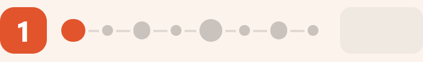

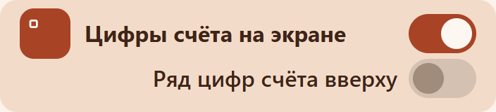

Если включить «Ряд цифр счёта вверху», точки и одна плашка прячутся. Сверху ряд из восьми квадратов, 1…8. Горит текущий счёт.

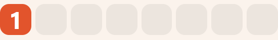

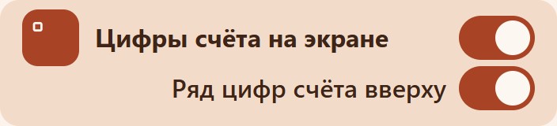

Выключили «Цифры счёта на экране» — вторая строка прячется, и цифр снова нет. Выбор «вверху» при этом запоминается: включили цифры на экране снова — строка возвращается в том же положении. Счёт на плашке ленты и в клике никуда не девается.

**Шаги над видео** — в разделе «Лента». Пока камера во весь экран и ленты не видно, сверху плашки в полтора раза выше обычной полосы. На главном экране переключателя нет.

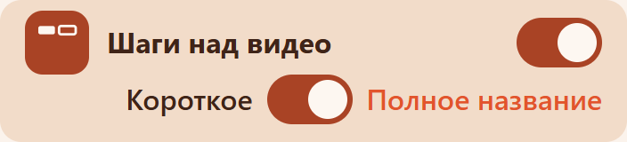

Карточка в настройках выше остальных: под включением вторая строка «Короткое», переключатель и «Полное название». Строка видна, только пока режим включён. По умолчанию переключатель стоит на полном названии, и сверху две плашки: слева текущий шаг, справа следующий.

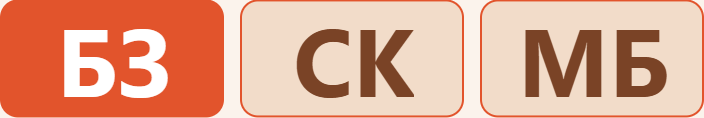

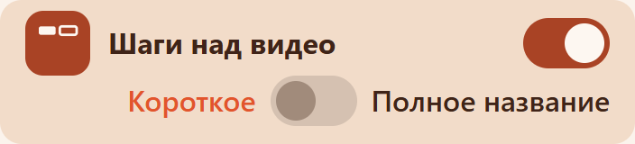

Если сдвинуть переключатель к «Короткое», на плашках короткое имя и справа появляется третья плашка со следующим шагом. Она просто стоит, без подсветки.

Точки и время скрыты под этими плашками. Если включены «Цифры счёта на экране», цифра счёта стоит в левом нижнем углу кадра, с тем же отступом от краёв, что крестик справа вверху. Ряд из восьми квадратов в этом режиме не показывается: его место занято плашками шагов. Выключенные «Цифры счёта на экране» убирают цифру совсем. Левая плашка залита акцентом. Пока шаг держится 4 счёта, два счёта она яркая, с третьего гаснет и к концу четвёртого пропадает. Когда плашка шага активна на 8 счетов, то же название стоит до 6-го счёта и гаснет на 7-м и 8-м. Следующая за те же счёта набирает цвет от обычной плашки к акценту, как третья плашка на ленте.

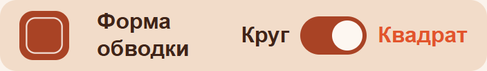  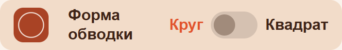

**Форма обводки** — квадрат или круг вокруг значка шага. На звук и порядок не влияет. Цветом акцента подсвечена выбранная сторона.

**Цветовая тема** — светлая, тёмная или «авто» (как в системе). Экран открывается сразу в выбранной теме и схеме. Ниже — готовые схемы: цвет фона, плашек и акцента. Кнопки и значки подстраиваются под выбранную схему. Галочка стоит на той, что сейчас включена. Кадры в этой инструкции сняты на светлой теме, схема «Терракота».

На экране телефона в этот список влезает около шести карточек, три ряда. Всех схем сорок, ниже они по десять на кадр. Кадр примерно втрое уже кнопки «Цветовая тема».

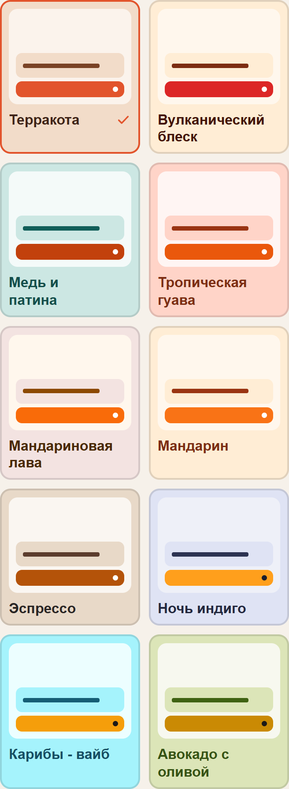   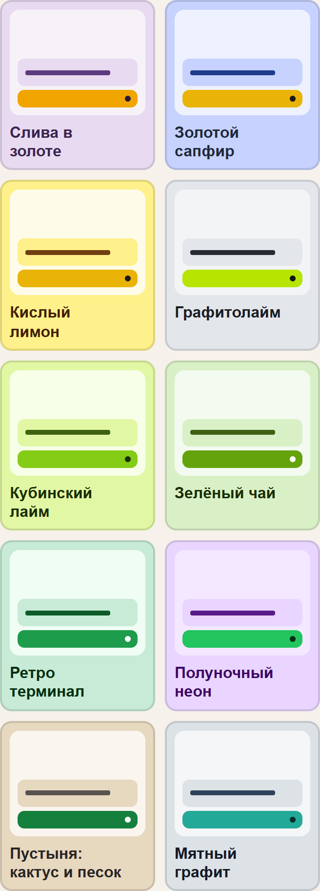   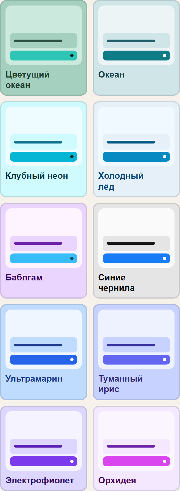   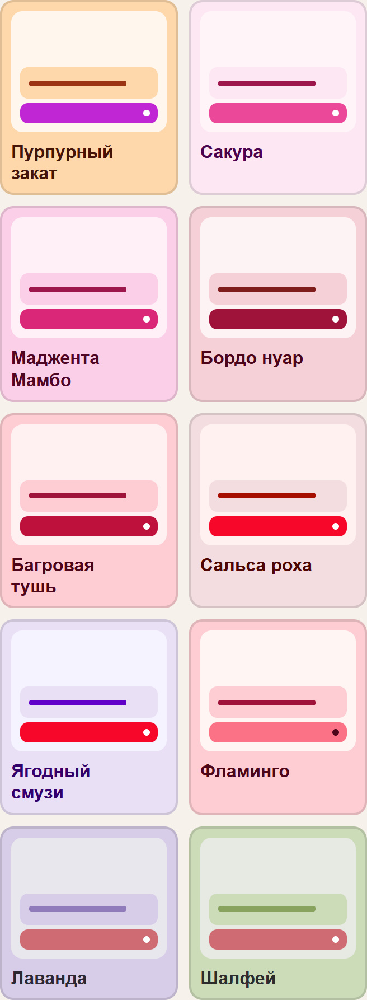

---

## Вибрация

Раздел «Устройство».

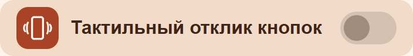

**Тактильный отклик кнопок** — короткая вибрация на нажатия. На телефоне без мотора этого пункта нет. По умолчанию выключено, чтобы не жужжало зря.

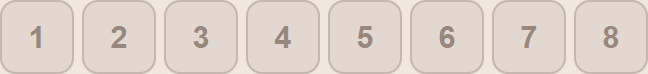

**Вибрация на счет** — восемь кнопок, 1…8. Отмеченные доли коротко вибрируют во время игры. Сильные 1 и 5 можно отметить одни, можно все восемь, можно ни одной. На телефоне без мотора ряд спрятан.

**Часы** — следующий пункт в том же разделе. На экране код: его вводят на браслете. Когда связь есть, надпись меняется на «Браслет связан с этим телефоном», ниже кнопка «Отвязать». С браслета можно запустить и остановить танец и запись с камеры. «Отвязать» разрывает связь, и команда, которая уже была в пути, после этого не выполняется.

---

## Шаблоны, копия, обзор

**Шаблоны цепочек шагов.** Нажатие на шаблон подставляет его цепочку на ленту. «Сохранить цепочки шагов» пишет файл `chains-дата` в загрузки. «Загрузить цепочки шагов» читает только такой формат файла. В файле сохраняются и созданные вами шаги.

**Резервная копия** — другое. Туда входят переключатели, цветовая схема, цепочка и сетка уже скачанных треков: темп и откуда в песне начинается счёт. Сами файлы музыки и видео в копию не входят. Файл называется `backup-дата`.

**Обзор приложения** открывает экран «Ясно». **Краткий обзор** — короткие кадры: что где нажимать. **Подробное описание** — этот текст.

При первом запуске приложение само спрашивает: «Показать короткий обзор?». «Потом» откладывает, «Показать» листает. Кадры листаются тапом, закрыть можно крестиком. Закрыли из настроек — снова экран «Ясно». С первого запуска — главный экран.

**Написать разработчику** — сообщение до 1000 знаков. Уходит номер версии, чтобы было понятнее, о чём вы пишете.

**Проект на GitHub** открывает страницу проекта. В сборке для ВК кнопка называется «Проект на GitVerse».

---

## Что запоминается

Темп, цепочка, свои шаги, шаблоны, схема, переключатели ленты, избранное в каталоге и режим камеры хранятся на этом устройстве. Другой телефон их не увидит, пока вы не перенесёте резервную копию или файл цепочек.

Смена шага, пауза без скачка и сильные доли 1 и 5 не зависят от этих переключателей. Их нельзя «включить наоборот»: это сам счёт.

---

## Площадки

В Мессенджере видео можно ещё отправить в чат с ботом, а после сохранения ролик обычно можно обрезать штатными средствами.

В приложении на Android экран тот же. Обновление оболочки приходит само, когда выходит новая сборка. Страница внутри может обновиться раньше оболочки: это нормально, счёт и кнопки остаются теми же. Там же, в «Моих записях», скачанные песни можно положить в папку «Музыка/STeps».

В браузере имя сохранённого ролика обычное: Dance-Steps и дата.
