# STeps — Тренажер для отработки движений

Mini App для Мессенджера: тренировка базовых шагов, музыкальный счёт **1…8**, вертикальная лента плашек и смена названия на долях **5** и **1**.

**Открыть:** [Gung Fu STeps](https://t.me/GungFuBot/STep)

## Android — Важные шаги

То же приложение в лёгкой Android-оболочке: метроном, музыка, камера, «Мои записи», обновления без магазина.

**Скачать APK:** [Важные шаги 1.0.12](https://github.com/ilexahub/steps/releases/tag/stepslight-1.0.12)  
(в Assets — `STEPSLight-1.0.12-release.apk`)

На телефоне разрешите установку из этого источника (браузер / «Загрузки» / файловый менеджер), затем откройте скачанный файл.

## Как это работает

- Лента шагов проходит через неподвижную рамку фокуса — текущий шаг всегда по центру.
- Счёт в шапке — музыкальный **1…8** (акцент на 1 и 5), не номер плашки.
- Режим **метронома** или **музыки (mp3)** с BPM из каталога.
- Настройки: последовательность шагов, перемешивать список шагов, цветовые схемы, движение ленты.

## Контакт

В приложении: **Настройки → Написать разработчику**

## Правовая информация

- [Политика конфиденциальности](PRIVACY.md)
- [Условия использования](TERMS.md)
- [Самопроверка / ответ модератору (VK)](VK-SELF-CHECK.md)

Эти же ссылки на политику и условия открываются из приложения (**Настройки**). Для кабинета ВКонтакте удобны прямые URL:

- https://github.com/ilexahub/steps/blob/master/PRIVACY.md
- https://github.com/ilexahub/steps/blob/master/TERMS.md

История версий: [ChangeLog](CHANGELOG.md)

## Скриншоты

Цветовая схема **Терракота** (первая в списке). Полный набор — в `screenshots/light/` и `screenshots/dark/`.

Короткий обзор кнопок одним роликом (~50 КБ): [coach/obzor.webp](coach/obzor.webp). Отдельные кадры — `coach/01-speed.webp` … `coach/10-templates.webp`.

### Светлая тема

| Лента | В движении |
| --- | --- |
| 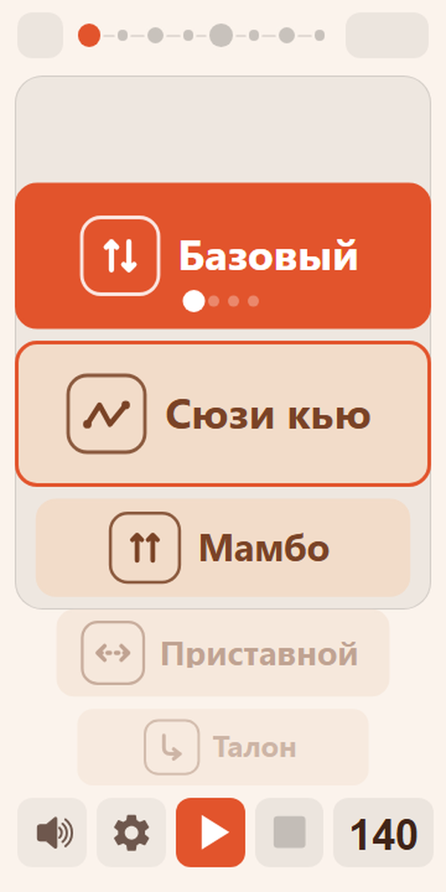 |  |

| Настройки | Цепочка шагов |
| --- | --- |
|  | 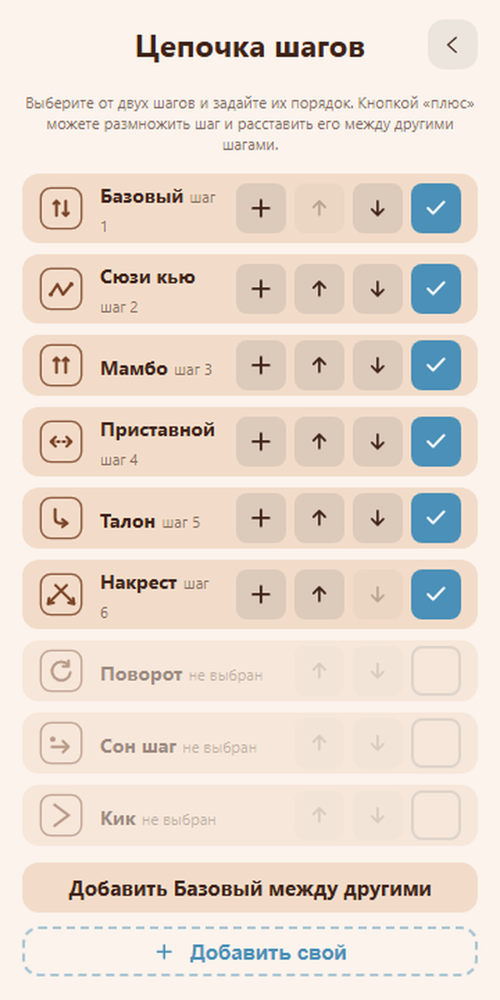 |

| Движение плашек | |
| --- | --- |
| 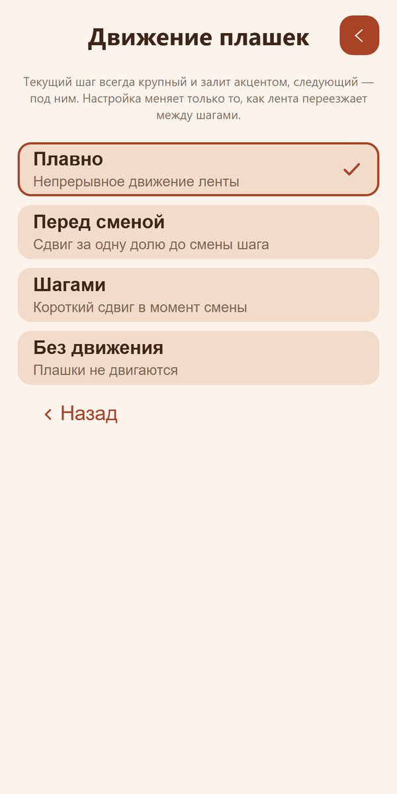 | |

| Цветовая схема | Музыка (mp3) |
| --- | --- |
| 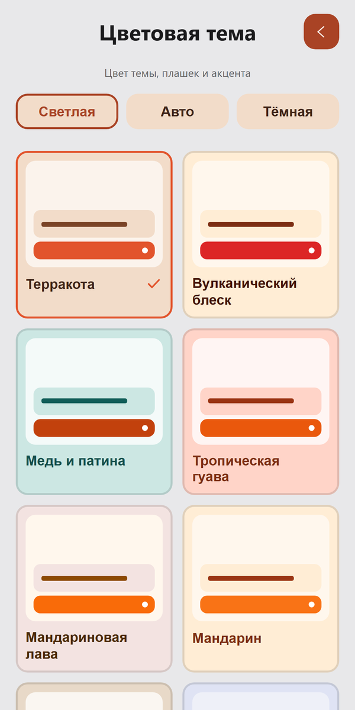 | 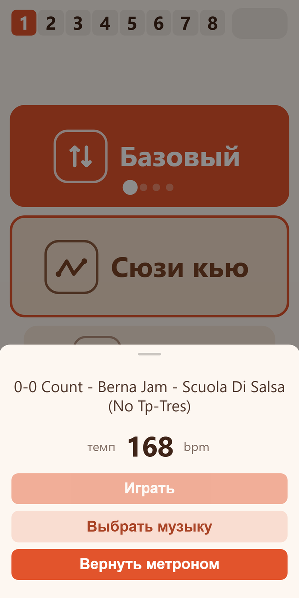 |

| Камера (маленькое) | Камера на весь экран |
| --- | --- |
| 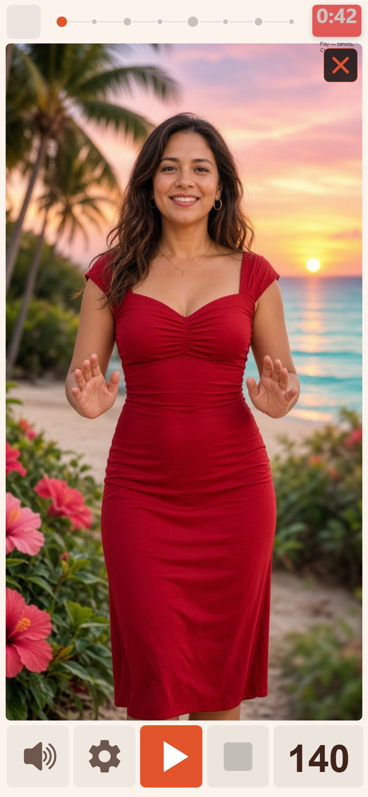 | 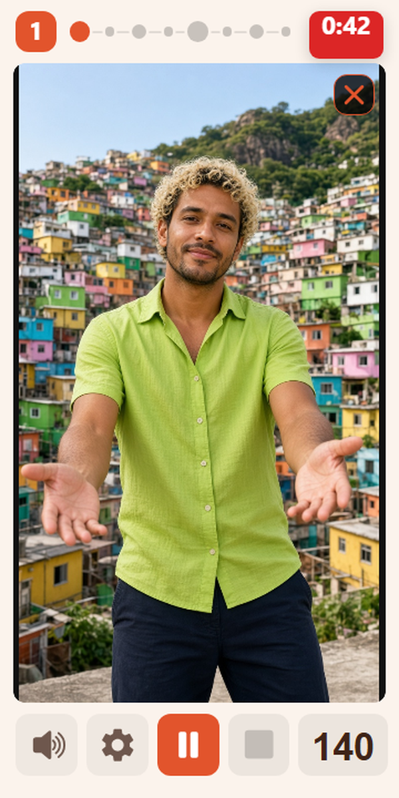 |

### Тёмная тема

| Лента | В движении |
| --- | --- |
| 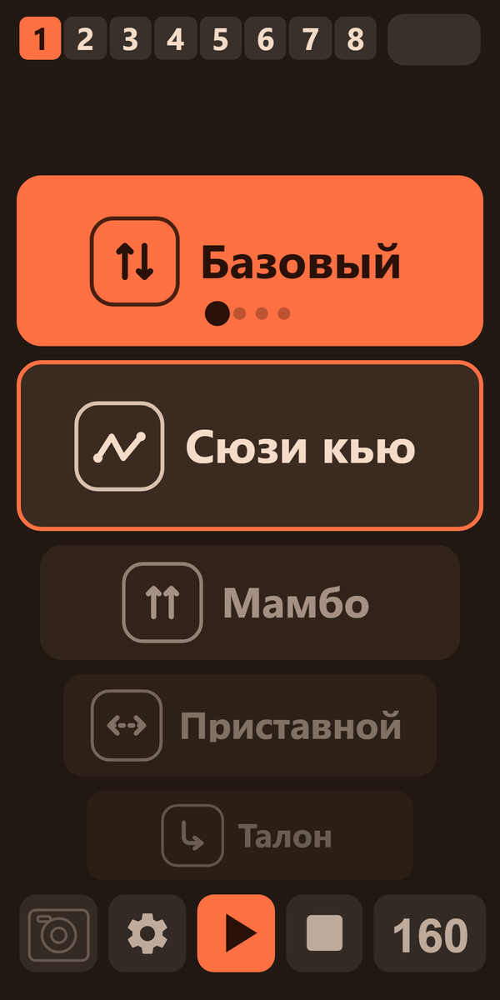 | 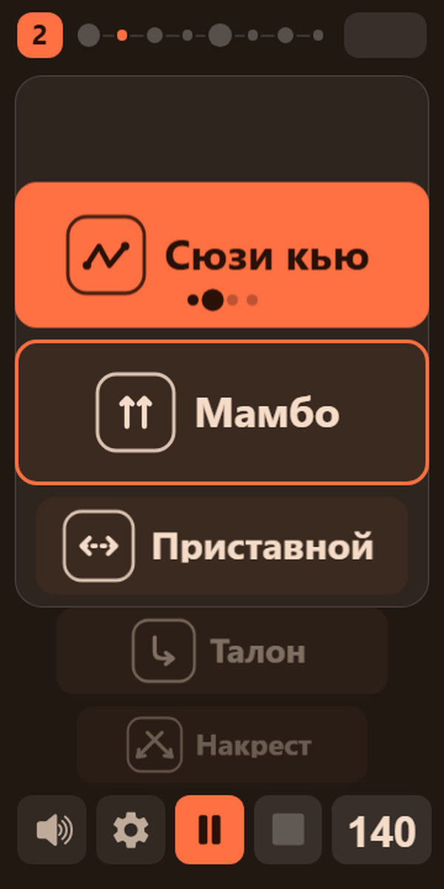 |

| Настройки | Цепочка шагов |
| --- | --- |
| 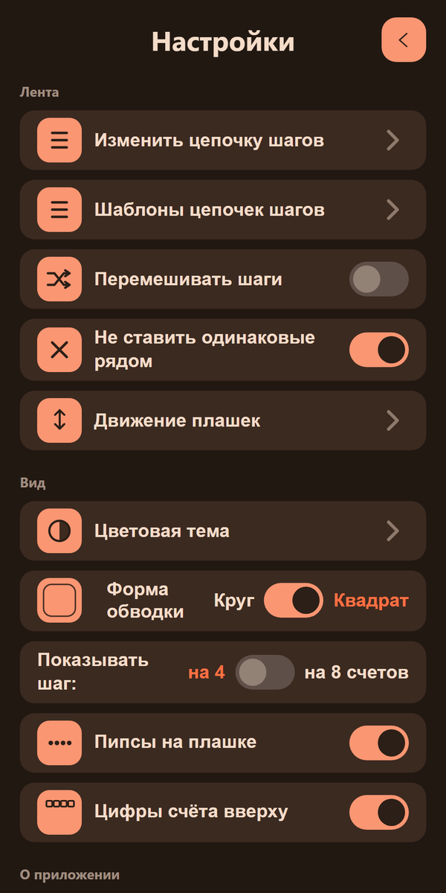 | 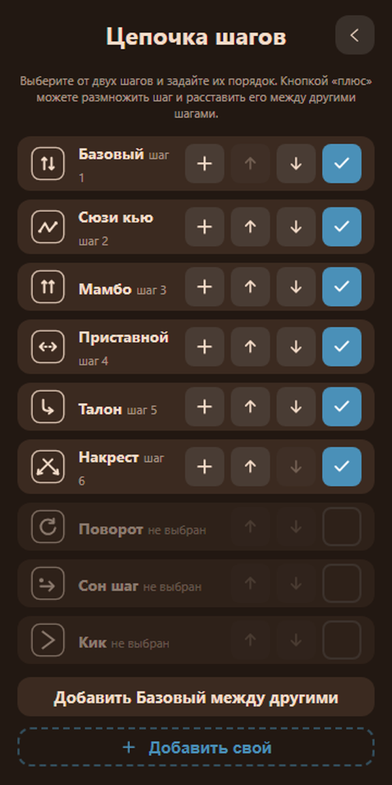 |

| Движение плашек | |
| --- | --- |
| 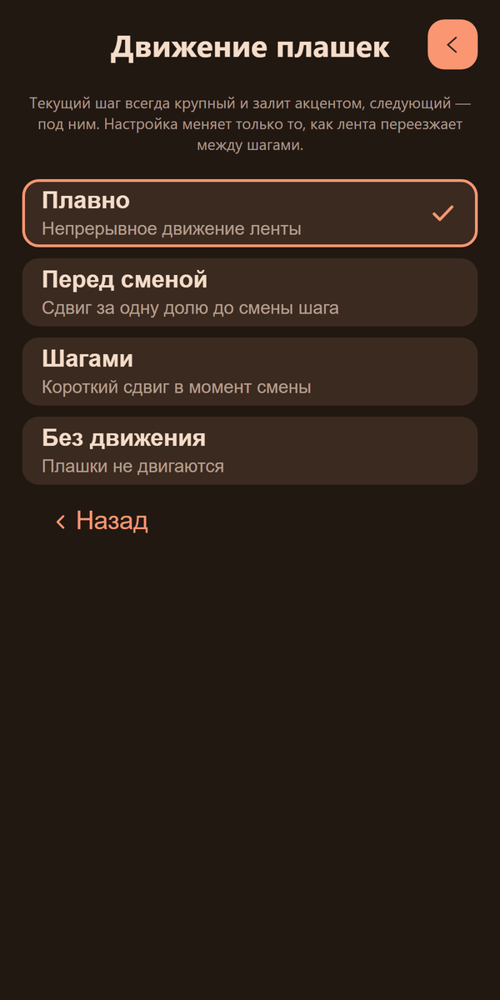 | |

| Цветовая схема | Музыка (mp3) |
| --- | --- |
| 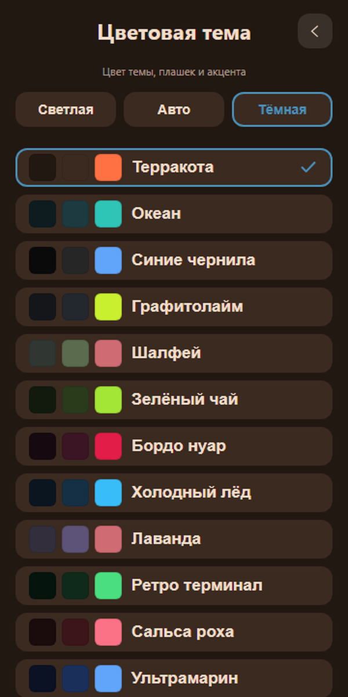 | 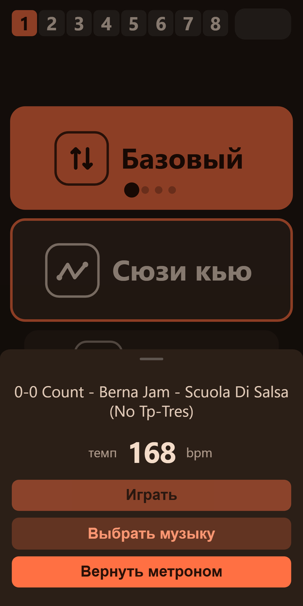 |

| Камера (маленькое) | Камера на весь экран |
| --- | --- |
| 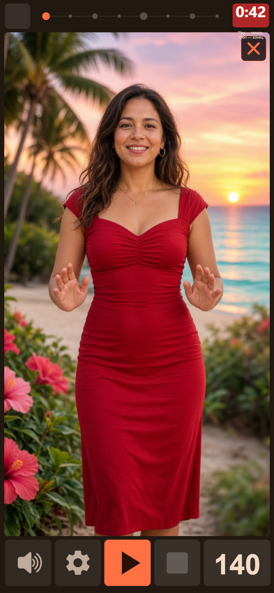 | 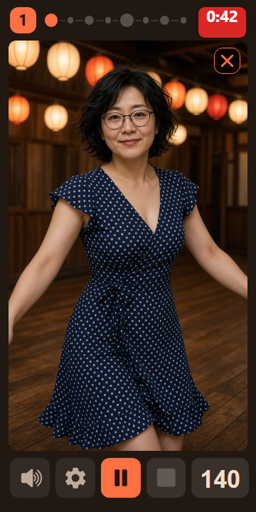 |
