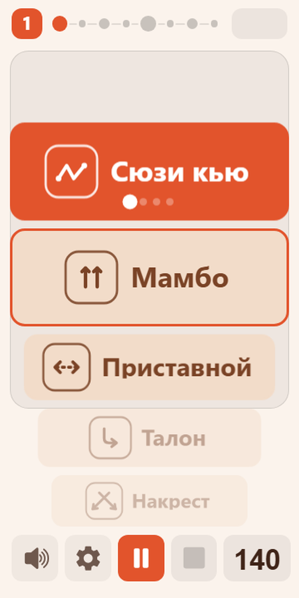
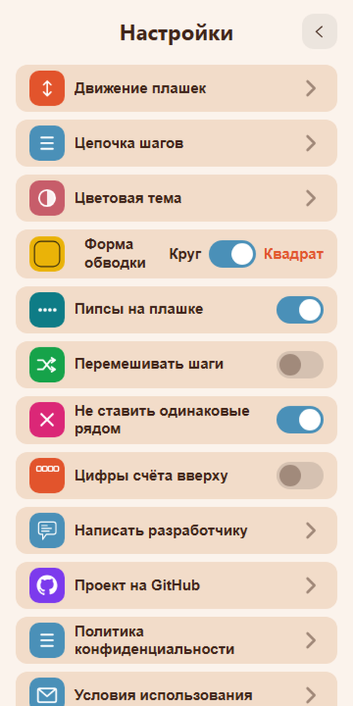

# STep — визуальный метроном для отработки движений

Telegram Mini App для тренировки базовых шагов: музыкальный счёт **1…8**, вертикальная лента плашек и смена названия на долях **5** и **1**.

**Открыть:** [t.me/GungFuBot/STep](https://t.me/GungFuBot/STep)

## Как это работает

- Лента шагов проходит через неподвижную рамку фокуса — текущий шаг всегда по центру.
- Счёт в шапке — музыкальный **1…8** (акцент на 1 и 5), не номер плашки.
- Режим **метронома** или **музыки (mp3)** с BPM из каталога.
- Настройки: последовательность шагов, перемешивать список шагов, цветовые схемы, движение ленты.

## Контакт

В приложении: **Настройки → Написать разработчику**.

## Скриншоты

| Лента | В движении |
| --- | --- |
|  |  |

| Настройки | Цветовая схема |
| --- | --- |
|  |  |

История версий: [CHANGELOG.md](CHANGELOG.md).
