# Важные шаги

Тренажер для отработки движений: музыкальный счёт **1…8**, вертикальная лента плашек и смена названия на долях **1** и **5**.

**Скачать APK:** [Важные шаги](https://github.com/ilexahub/steps/releases)

На телефоне разрешите установку из этого источника (браузер / «Загрузки» / файловый менеджер), затем откройте скачанный файл.

То же приложение — Mini App в Мессенджере: [Gung Fu STeps](https://t.me/GungFuBot/STep)

## Как это работает

Лента шагов проходит через неподвижную рамку: текущий шаг всегда крупный и по центру, следующий — под ним. Счёт в шапке — музыкальный **1…8** (акцент на 1 и 5), это не номер плашки. На **1** и **5** меняется название шага; если плашка активна на 8 счетов — только на **1**. Пуск и стоп — кнопки внизу; скорость — чип BPM.

**Метроном или музыка.** С листа скорости запускается клик метронома, темп можно двигать. «Выбрать музыку» открывает каталог: у трека уже свой BPM, его не крутят руками. «Играть» / пауза. Перемотка ставит плашку на то место в треке; пауза ленту не сдвигает. Трек с витрины начинает играть, не дожидаясь Диска. «Вернуть метроном» выключает трек и оставляет клик. Звук клика на листе можно выключить — шаги на экране идут как раньше.

**Цепочка и вид.** В настройках собирается последовательность шагов (порядок, повтор кнопкой «плюс»), её можно сохранить как шаблон и подставить другую. «Перемешивать шаги» тасует порядок при старте с начала; вторая строка «Не ставить одинаковые рядом» видна только пока перемешивание включено. «Движение плашек» не меняет, какой шаг сейчас главный, только как лента переезжает: плавно, сдвиг перед сменой, коротко в момент смены, без движения или «Ностальгия» — шаги сеткой, лента не едет. «Плашка шага активна»: на 8 счетов один шаг — одна плашка на всю восьмёрку. Пока выбрано 4, вторая строка «Показывать шаг»: «на 4» меняет карточку каждые четыре счёта, «на 8» ставит две плашки одного шага. Тема: светлая / авто / тёмная и цветовая схема (на скриншотах — Терракота); экран открывается сразу в выбранной. «Показывать иконку» выключена: на плашке только название. Включили — значок, круг или квадрат. По желанию пипсы на плашке. «Цифры счёта на экране» по умолчанию выключены. Включили — слева одна цифра и точки посередине; вторая строка «Ряд цифр счёта вверху» ставит восемь квадратов 1…8. «Шаги над видео» — при камере на весь экран: сверху две плашки с полным названием, в полтора раза выше обычной полосы. «Короткое» ставит аббревиатуру и третью плашку справа. Пока шаг держится четыре счёта, текущий два счёта яркий, с третьего гаснет и к концу четвёртого пропадает. На восьми счетах то же название стоит до шестого и гаснет на седьмом и восьмом. Если имя не влезает на плашку, в конце точка.

**Камера.** Иконка в нижнем ряду включает съёмку, лента и счёт не останавливаются. Картинка — на весь экран или маленьким окном в углу; тап по кадру меняет размер. На листе скорости те же три режима: скрыто, маленькое, во весь экран. Запись и стоп — красная кнопка на кадре: если звук ещё стоит, она сначала запускает его. В шапке течёт время ролика. В видео попадает звук приложения (метроном или выбранный трек), не микрофон улицы. Крестик на превью выключает камеру.

После стопа: сохранить на устройство, открыть **«Мои записи»**, отложить («Посмотрю позже») или не сохранять. Из «Моих записей» ролик можно посмотреть на странице или забрать позже.

**Инструкция:** [Как пользоваться](GUIDE.md) — https://github.com/ilexahub/steps/blob/master/GUIDE.md

## Контакт

В приложении: **Настройки → Написать разработчику**

## Правовая информация

- [Политика конфиденциальности](PRIVACY.md)
- [Условия использования](TERMS.md)

Эти же ссылки открываются из приложения (**Настройки**). Для кабинета ВКонтакте удобны прямые URL:

- https://github.com/ilexahub/steps/blob/master/PRIVACY.md
- https://github.com/ilexahub/steps/blob/master/TERMS.md

История версий: [ChangeLog](CHANGELOG.md)

## Скриншоты

Цветовая схема **Терракота** (первая в списке). Полный набор — в `screenshots/light/` и `screenshots/dark/`.

Короткий обзор кнопок, кадры 600×1200: `coach/01-speed.webp` … `coach/10-templates.webp`. Ролик по 2 секунды на кадр: [coach/obzor.mp4](coach/obzor.mp4) (превью в чате) и [coach/obzor.webp](coach/obzor.webp).

### Светлая тема

| Лента | В движении |
| --- | --- |
| 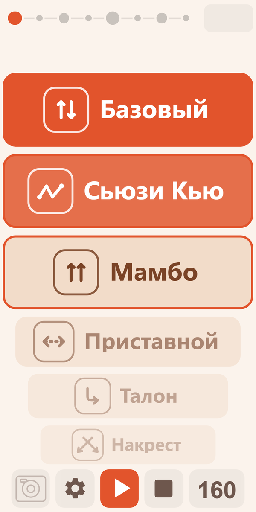 | 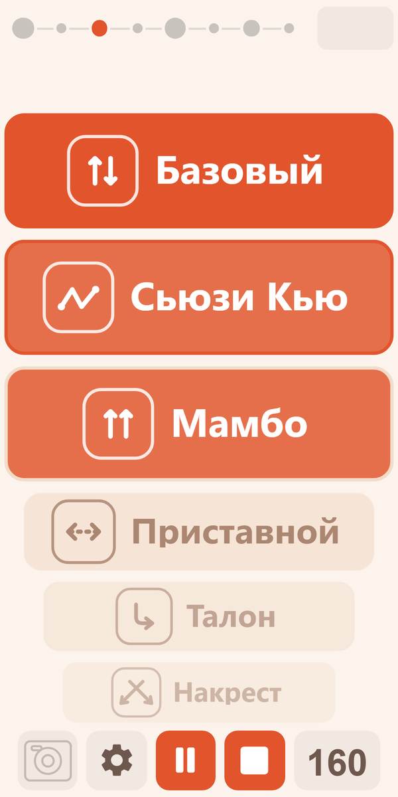 |

| Настройки | Цепочка шагов |
| --- | --- |
| 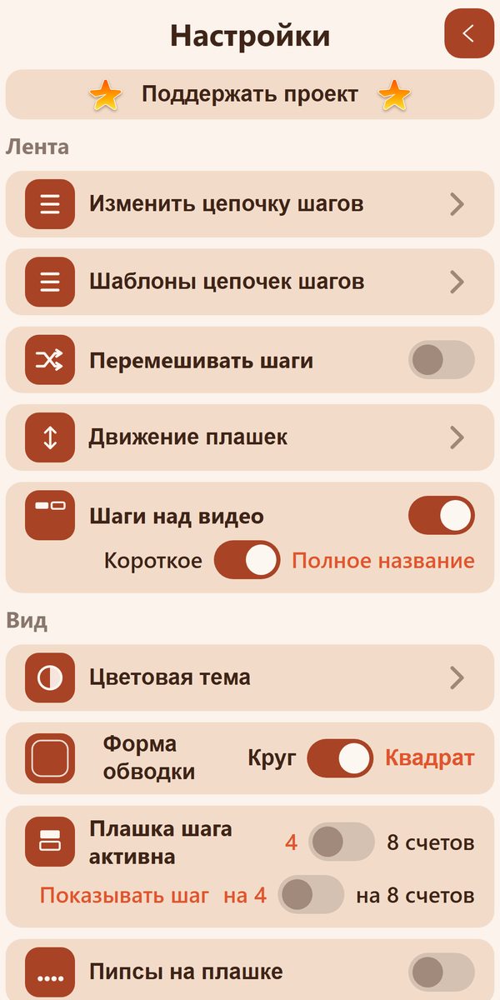 | 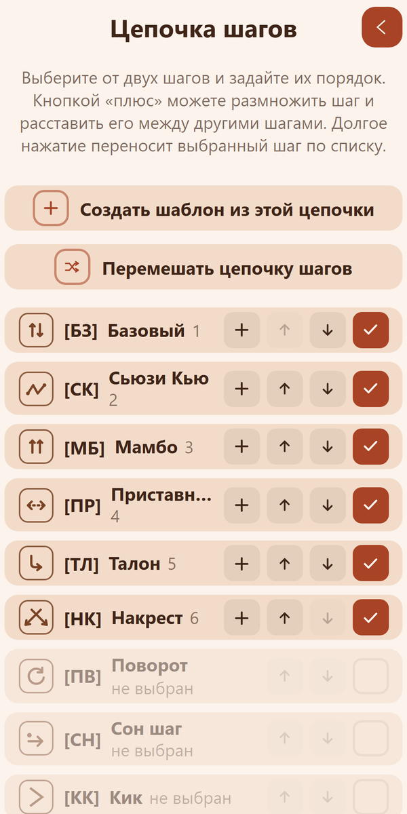 |

| Движение плашек | |
| --- | --- |
| 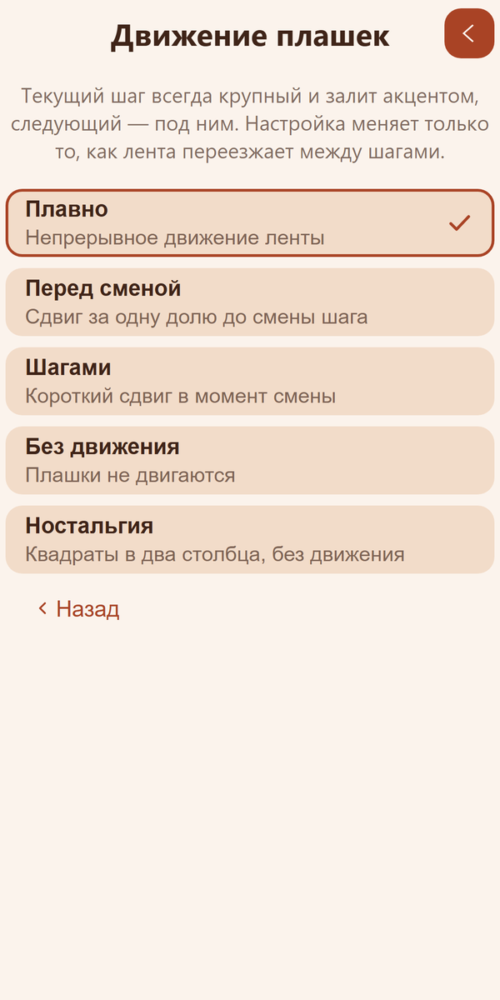 | |

| Цветовая схема | Музыка (mp3) |
| --- | --- |
| 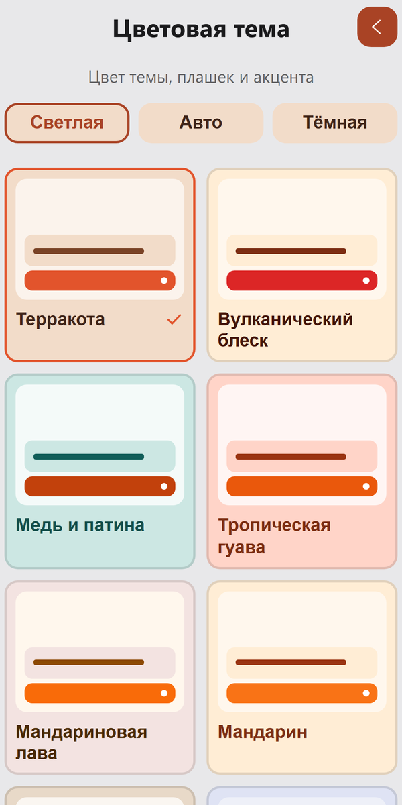 | 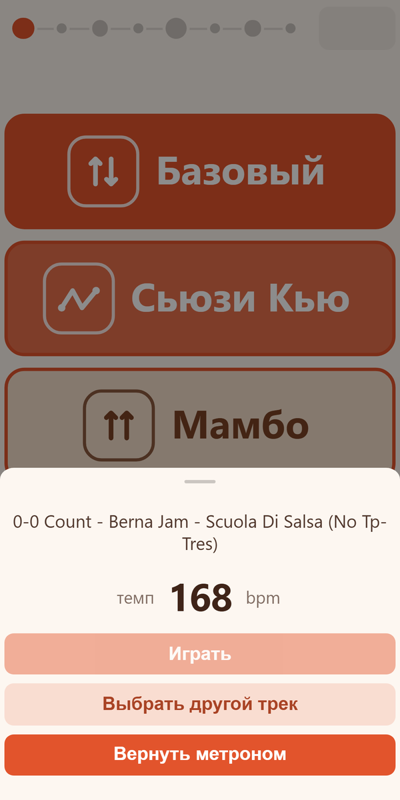 |

| Камера (маленькое) | Камера на весь экран |
| --- | --- |
| 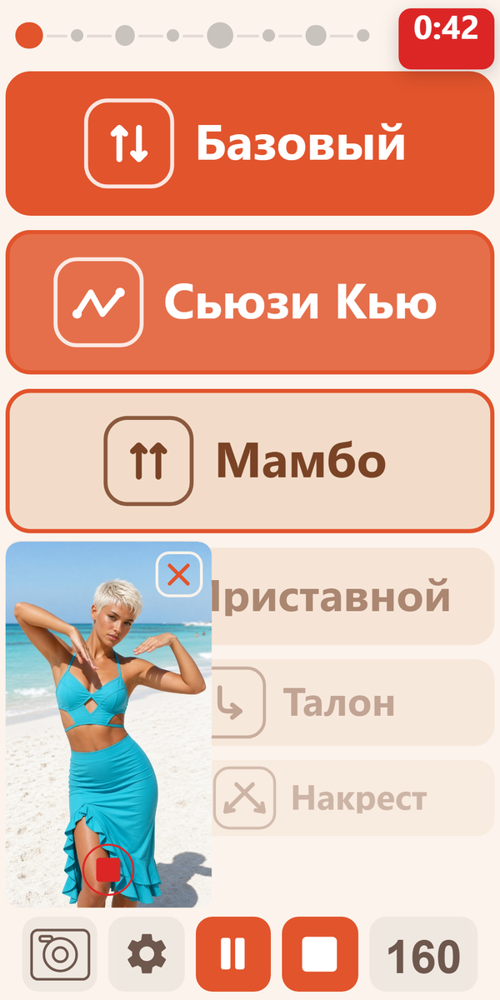 | 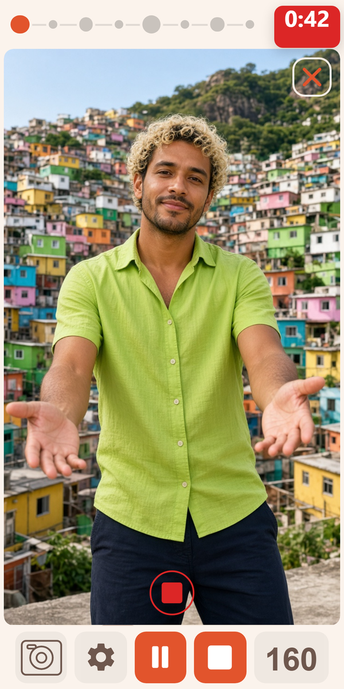 |

### Тёмная тема

| Лента | В движении |
| --- | --- |
| 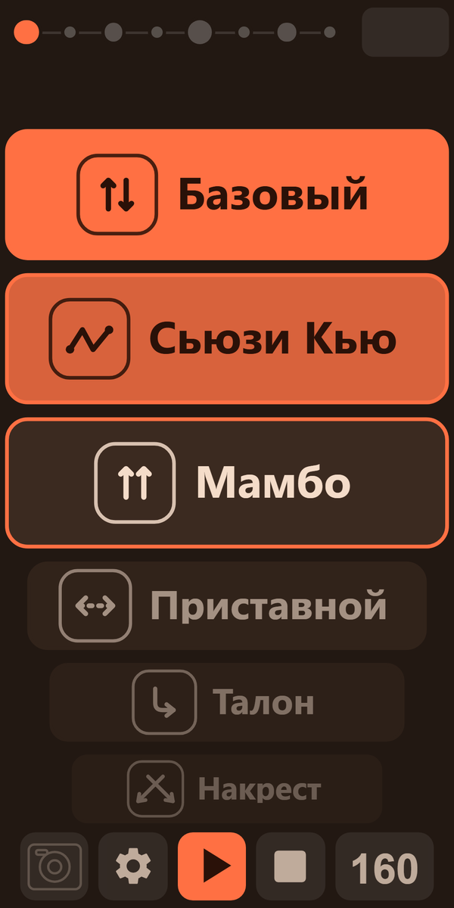 | 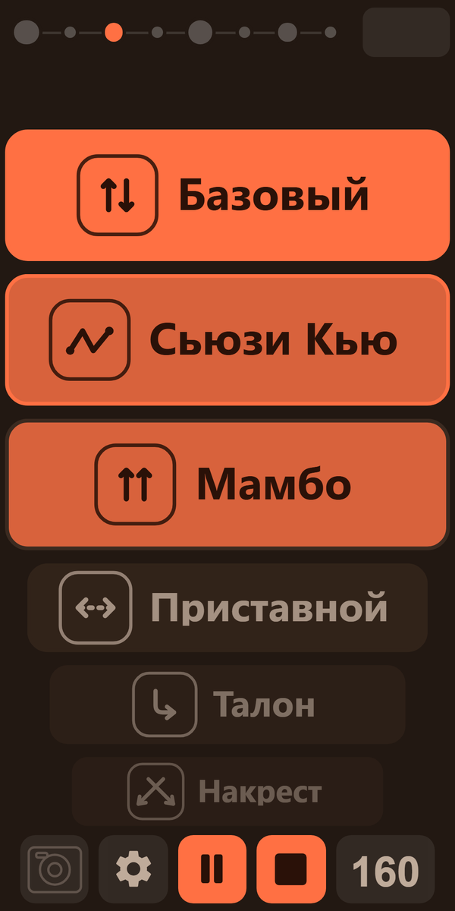 |

| Настройки | Цепочка шагов |
| --- | --- |
| 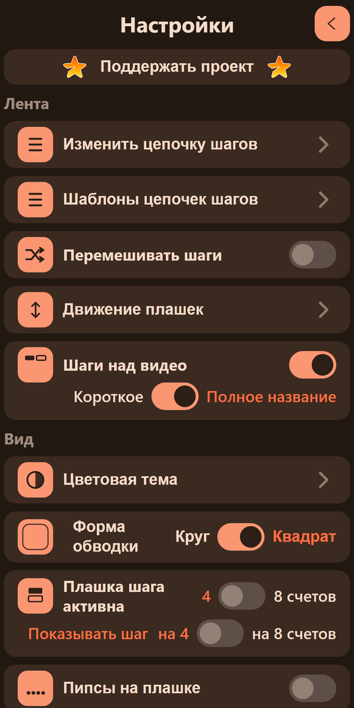 | 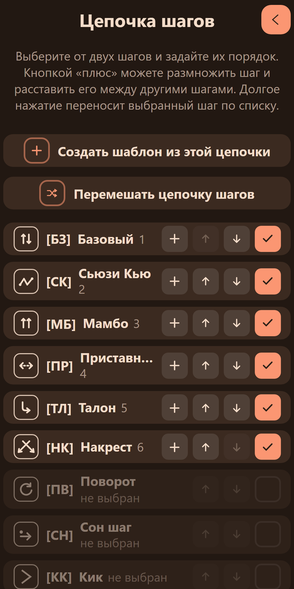 |

| Движение плашек | |
| --- | --- |
| 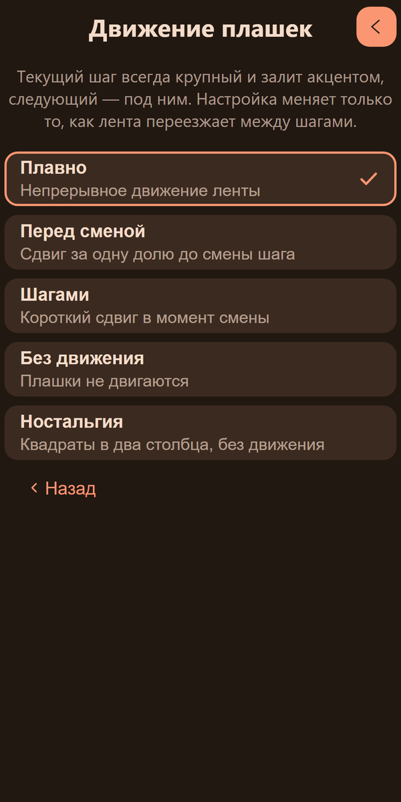 | |

| Цветовая схема | Музыка (mp3) |
| --- | --- |
| 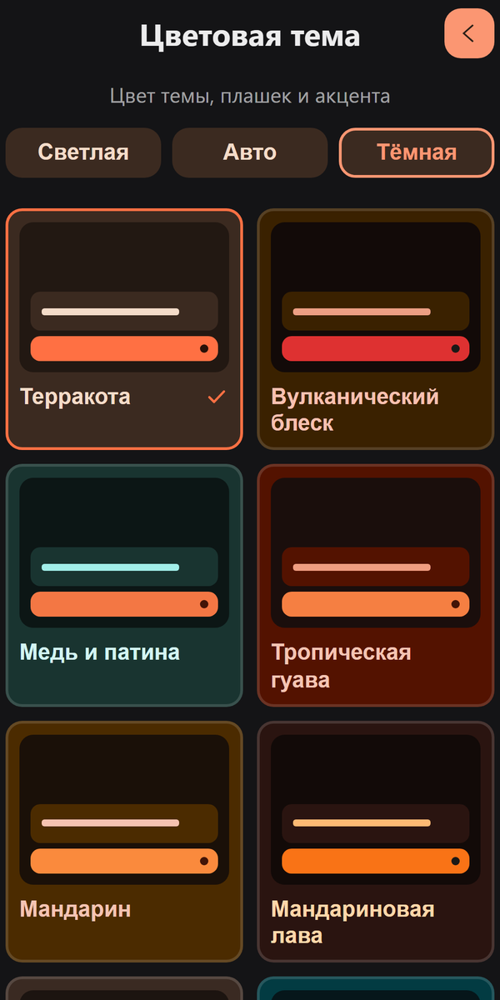 | 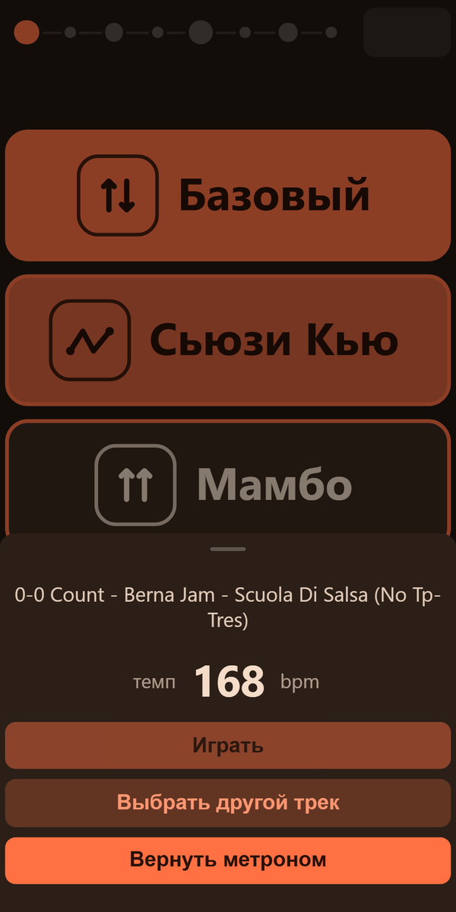 |

| Камера (маленькое) | Камера на весь экран |
| --- | --- |
| 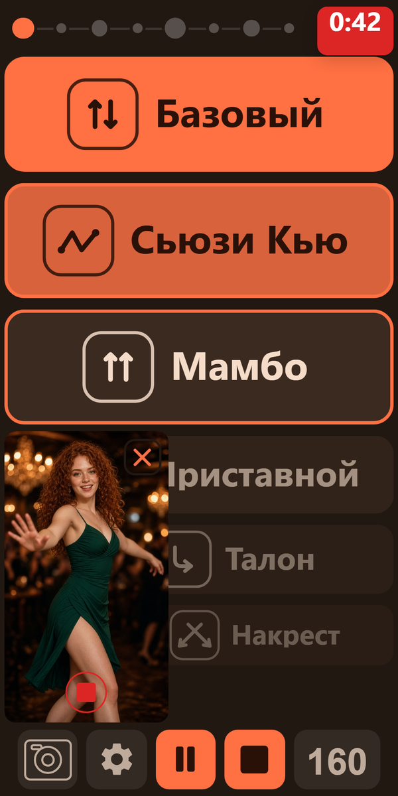 | 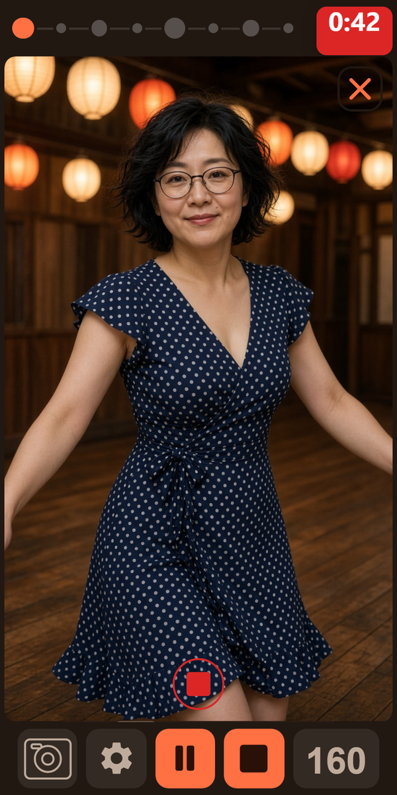 |
